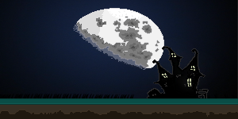

# Ghost of the Forest - JavaScript Game

## 📖 Story
The game’s narrative revolves around wicked spirits that inhabit a forest, aiming to dominate the world and kidnap people. However, not all spirits are malevolent; a friendly ghost helps liberate people from this tyranny and battles against the evil spirits.

## 🎮 Game Content
- **Arena**: Set in a mystical forest.
- **Character**: You control the friendly ghost.
- **Levels**: The game consists of 4 stages:
  - **Stage 1**: The ghost must reach the door.
  - **Stage 2**: There are two doors, and you decide which one the ghost should go through.
  - **Stage 3**: The ghost must collect a key and then go to the castle.
  - **Stage 4**: The ghost is in the castle and must rescue a person.

## 🛠️ Technologies
- **Programming Language**: JavaScript
- **Platform**: Browser-based

## 📺 Demo
Watch the project in action: [YouTube Link](https://www.youtube.com/watch?v=bjJ2ZPPqR_c)
